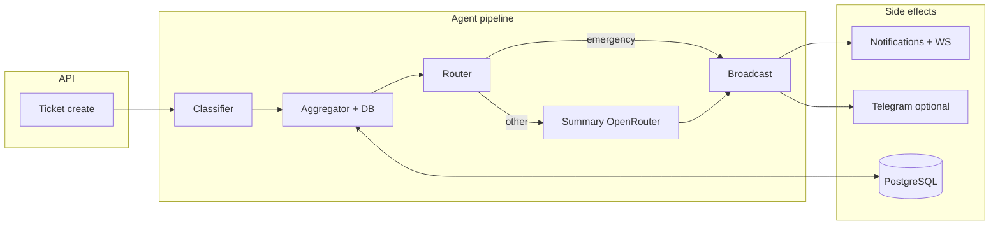

# Backend integration plan — make the core run end-to-end

This plan lists **what is wrong or missing today**, then **ordered work** so auth, DB, agents, notifications, Telegram, and analytics **compose cleanly** without import errors, silent failures, or duplicate rows.

**Progress (recent):** Phase 1 wiring (pipeline + DB + wrappers + `agent_persist` before broadcast), Phase 2 (notify + `db`), Phase 3 (Telegram in broadcast), OpenRouter settings, escalation `changed_by` admin UUID, **`POST /api/v1/agents/dry-run`**, **`.env.example`**, **`langgraph` removed** from requirements, **`analytics.py`** re-exports `analytics_service`, **`tests/`** (pytest: router, mocked classifier, `agent_persist` on SQLite).

---

## Target runtime flow (what “done” looks like)

**Definition of done:** Creating a ticket triggers **one** coherent pipeline run, **persists** routing outputs, **notifies** the right roles with a **real DB session**, optionally **sends Telegram**, and **ticket/problem rows** stay consistent for analytics.

---

## A. What is incorrect today (bugs / mismatches)

| # | Area | Issue |
|---|------|--------|
| A1 | **`pipeline.py` ↔ agents** | Imports **`classify_problem`** and **`aggregate_problem`**, but **`classifier.py`** only defines **`ClassifierAgent`**, **`aggregator.py`** only **`AggregatorAgent.run(..., db)`**. **Import will fail** when the pipeline loads. |
| A2 | **`run_pipeline` / tickets** | **`create_ticket_from_problem`** commits, then calls **`run_pipeline`** with **no DB**. Aggregator **needs `AsyncSession`** to read/write `AggregationGroup` / `Problem`. |
| A3 | **Duplicate `Problem` rows** | Ticket creation **`db.add(Problem(...))`** inserts a minimal problem; aggregator **`Problem(...)`** inserts **another** row for the same ticket. **Two problems per ticket** unless logic is unified (update vs insert). |
| A4 | **`openrouter_client.py` ↔ `config.py`** | Client uses **`settings.openrouter_api_key`**, **`openrouter_base_url`**, etc. **`Settings` does not define them** → **AttributeError** when summary runs (unless code path never hit). |
| A5 | **`broadcast.py` ↔ notifications** | **`notify_destination(..., db=None)`** → stub path **`sent: 0`**, **no DB rows**, **no WebSocket push**. |
| A6 | **`auto_escalate_overdue_tickets`** | **`TicketHistory.changed_by`** is **`UUID` FK to users**; code passes **`"system"`** string → **invalid for DB** / type error at runtime. |
| A7 | **Ticket vs classifier** | New tickets use **fixed** `TicketCategory.administrative` / default priority; classifier output **never written back** to `Ticket` / `Problem` → analytics and UI stay out of sync with LLM. |
| A8 | **Emergency path** | Emergency skips **`build_summary`** but **`structured_summary`** may be empty → poor broadcast text unless fallback is set in **`broadcast_result`**. |

---

## B. What is not implemented (or only stubbed)

| # | Item | Notes |
|---|------|--------|
| B1 | **HTTP agent API** | **`routes/agents.py`** — empty router; no admin/debug **dry-run** or **replay** endpoint. |
| B2 | **End-to-end tests** | No automated test that **creates ticket → pipeline → notification**. |
| B3 | **SMTP / email** | Config keys exist; **no mailer** wired to notifications. |
| B4 | **`app/services/analytics.py`** | Placeholder file; real logic is **`analytics_service.py`** — **confusing** or dead code. |
| B5 | **Telegram from broadcast** | **`telegram_sent`** is **heuristic**; **no guaranteed `send_to_group`** from pipeline (by design to avoid cycles — needs a **thin façade** or **events**). |
| B6 | **`.env` / docs** | Single **documented** list of required vars (incl. OpenRouter after A4 fixed). |
| B7 | **LangGraph** | Listed in **`requirements.txt`**; **not used** in code paths — either **use** or **remove** to avoid drift. |

---

## C. Phased work plan (recommended order)

### Phase 1 — Core correctness (must do first)

**Goal:** App boots; importing `pipeline` works; ticket creation does not corrupt data.

1. **Expose a single public API for agents**
   - Add **`async def classify_problem(state: AgentState) -> AgentState`** that delegates to **`ClassifierAgent().run(state)`** (same file or thin wrapper).
   - Add **`async def aggregate_problem(state: AgentState, db: AsyncSession) -> AgentState`** that delegates to **`AggregatorAgent().run(state, db)`**.
2. **Change the pipeline signature** to accept DB:
   - **`async def run_agent_pipeline(state: AgentState, db: AsyncSession) -> AgentState`**
   - Call **`await aggregate_problem(state, db)`** after classifier.
3. **Fix `run_pipeline` in `app/services/agents.py`**
   - Accept **`db: AsyncSession`** (or create a **new** session with `SessionLocal()` only if you document transaction boundaries — prefer **caller passes `db`** from `create_ticket_from_problem` **before** outer commit, or **open second session** for pipeline-only work).
   - **Recommended pattern:** after initial ticket+problem commit, **`async with SessionLocal() as session:`** run pipeline in **its own transaction**, then refresh ticket row if you update category/priority.
4. **Unify `Problem` lifecycle**
   - Either: **remove** initial `Problem` insert from `create_ticket_from_problem` and let **aggregator** create the canonical row; **or** **update** the existing `Problem` in the aggregator instead of inserting a second row.
5. **Add OpenRouter fields to `Settings`** (and **`.env.example`**):  
   `openrouter_api_key`, `openrouter_base_url`, `openrouter_model`, `openrouter_referer`, `openrouter_title` (defaults acceptable for dev).

**Exit criteria:** Manual test: POST ticket → no import error → classifier + aggregator + summary run (with valid keys) → single problem row per ticket (per chosen rule).

---

### Phase 2 — Broadcast & notifications (user-visible value)

**Goal:** Routed tickets actually notify staff.

1. **Thread `db` through broadcast**
   - **`async def broadcast_result(state: AgentState, db: AsyncSession | None)`**  
   - **`notify_destination(..., db=db)`** so notifications **persist** and **WebSocket** fires.
2. **Optional:** system/bot user UUID for automated history
   - Create a **dedicated system user** in seed/migration, or add **nullable `changed_by`** with migration — then fix **auto-escalation** to use a **valid UUID** (not `"system"`).
3. **Emergency summary fallback**
   - If emergency path skips LLM summary, set **`structured_summary`** to a **deterministic** short text before **`broadcast_result`**.

**Exit criteria:** Create ticket → DB shows `Notification` rows for target role(s) → WebSocket clients receive payload (manual test).

---

### Phase 3 — Telegram integration (optional but product-aligned)

**Goal:** Teacher destination can hit a real group without circular imports.

1. Introduce a **small façade** module (e.g. **`app/services/broadcast_delivery.py`**) that depends on **`notifications`** + **`telegram`**, called from **`broadcast_result`** with **`db`**, or use **FastAPI `Depends`** only at route layer and keep agents pure — pick one architecture and stick to it.
2. **`send_to_group(db, class_id, message)`** when `destination == "teacher"` and group registered.
3. Set **`telegram_sent`** from **actual API result**, not `destination == "teacher"`.

**Exit criteria:** Registered class + teacher route → message appears in Telegram test group.

---

### Phase 4 — Data model alignment & analytics accuracy

1. After classifier runs, **map** `category` / `priority` to **`TicketCategory`** / **`TicketPriority`** enums and **UPDATE** `Ticket` (+ `Problem.language_detected`, `classified_category`).
2. Reconcile **aggregator `category` field** (string) with **enum** on ticket for reporting.
3. Remove or implement **`app/services/analytics.py`** stub; **single** entry point for analytics helpers.

---

### Phase 5 — API, tests, cleanup

1. **`GET/POST /api/v1/agents/...`** — admin-only **pipeline dry-run** (body: raw text + class_id) for debugging.
2. **Integration tests** with **mocked HTTP** for Mistral/OpenRouter.
3. **Prune unused deps** (e.g. LangGraph if unused).
4. **Document** env vars and runbook in **`README_SYSTEM.md`** (update §5–§6 after fixes).

---

## D. Dependency map (what must not import what)

| From | Should avoid importing | Prefer |
|------|-------------------------|--------|
| `app/agents/*` | Heavy FastAPI `Depends` | Pass **`AsyncSession`** as argument or use **`SessionLocal`** inside orchestration only in `run_pipeline`. |
| `broadcast.py` | Direct circular service graphs | **`notify_destination(db=...)`** first; Telegram via façade in Phase 3. |

---

## E. Suggested ownership of sessions (transactions)

- **Ticket creation:** one transaction: insert ticket + initial history (+ optional placeholder problem per Phase 1 decision) → commit.
- **Pipeline:** **new** `AsyncSession` scope recommended so LLM/HTTP slowness does not hold the first transaction open; **update same ticket/problem by ID** after pipeline success.
- **Notifications:** same session as **`notify_destination`** commit or short follow-up transaction — avoid double-commit bugs by documenting order.

---

## F. Checklist before declaring “full backend integrated”

- [x] `python -c "from app.agents.pipeline import run_agent_pipeline"` succeeds  
- [x] Create ticket → pipeline completes without exception — **automated:** `tests/test_pipeline_e2e.py` runs full `run_agent_pipeline` with **respx** (Mistral ×2, OpenRouter ×1) + SQLite; notifications/Telegram **mocked** at broadcast boundary  
- [x] Exactly **one** `Problem` row policy — aggregator **updates** by `ticket_id` when present (see `aggregator.py`)  
- [ ] **`Notification` rows** in a **real** PostgreSQL run — still **manual** (needs staff users + unmocked `notify_destination`)  
- [x] Escalation job: `changed_by` uses admin UUID (code path); **manual** cron verification optional  
- [x] OpenRouter settings in config; summary path covered in e2e mock  
- [ ] **Telegram send** to a real group — **manual** (register class + `teacher` destination)  

---

## G. Not implemented or only partial (backend scope)

| Area | Status |
|------|--------|
| **SMTP / email** | Config keys only; not wired into `notifications`. |
| **Rate limiting / idempotency** | Not implemented on routes. |
| **Full dry-run with aggregation** | `POST /agents/dry-run` is classifier → router → summary **only**; no DB aggregation. Optional future: admin endpoint with test DB or rollback. |
| **§F manual items** | Real-env ticket → in-app notification → Telegram as above. |
| **Frontend / mobile** | Out of repo scope. |
| **Full product vs `README_USE_CASES.md`** | Backend implements a **subset** (real routes + agents); not every narrative use case is automated end-to-end. |

---

*This file is the implementation roadmap; keep it updated as phases complete.*
