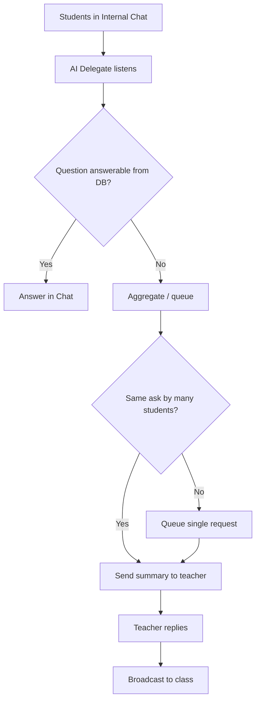

# Wasit — AI Delegate & Institutional Hierarchy (Feature README)

This document describes the **target product** for school → filière → class structure, **Chef de Filière** responsibilities, and the **AI Delegate** bot: flows, data concepts, API shape, intelligence layer, and **how it relates to the current `wasit-backend`**.

For day-to-day API setup see [`../README.md`](../README.md). For backend integration status see [`../README_SYSTEM.md`](../README_SYSTEM.md).

---

## Table of contents

1. [School → Filière → Class](#1-school--filière--class)
2. [Chef de Filière — powers](#2-chef-de-filière--powers)
3. [AI Delegate — role & flows](#3-ai-delegate--role--flows)
4. [What the AI can answer autonomously](#4-what-the-ai-can-answer-autonomously)
5. [Helper data for the AI (mutable)](#5-helper-data-for-the-ai-mutable)
6. [Poll & aggregation logic](#6-poll--aggregation-logic)
7. [Teacher ↔ AI Delegate (private channel)](#7-teacher--ai-delegate-private-channel)
8. [Implementation plan (phased)](#8-implementation-plan-phased)
9. [Intelligence layer (tools)](#9-intelligence-layer-tools)
10. [Key design decisions](#10-key-design-decisions)
11. [Alignment with current backend](#11-alignment-with-current-backend)

---

## 1. School → Filière → Class

### School

- One school has many **filières** (fields of study).
- A school-level **admin** manages global configuration and visibility.

### Filière (field of study)

- Has a **Chef de Filière** (head of department) — a dedicated role with elevated scope **within that filière**.
- Contains multiple **classes** (promotions, sections, groups).
- The Chef can create and manage:
  - **Classes** under their filière
  - **Human delegates** per class
  - **AI Delegate** configuration per class (see below)
  - **Trombinoscope** (student directory with photos)
  - **Emploi du temps** (timetable)

### Class (group)

- Belongs to **one** filière.
- Has **one human delegate** and **one AI delegate** (conceptually).
- Has an **Internal Chat channel** for class communication.
- Has a **trombinoscope** and an **emploi du temps** (and optionally exam schedule), as product scope expands.

### Reference data model (target)

These names are **conceptual**; the live DB may use slightly different table/column names (e.g. `Class` vs `Classe`, `responsible_id` vs `chef_id`).

School
  └── Filiere (chef / responsible user)
        └── Class
              ├── delegate (User)
              ├── AI Delegate (config + Chat behavior)
              ├── Internal Chat Channel
              ├── Trombinoscope / students
              └── Emploi du temps / exams (as modeled)

---

## 2. Chef de Filière — powers

The **Chef de Filière** can:

| Action | Description |
|--------|-------------|
| Create classes | Under their filière |
| Assign delegate | Human **delegate** user per class |
| Configure AI Delegate | Per-class bot behavior, prompts, activation |
| Manage timetable | Upload / update **emploi du temps** |
| Manage trombinoscope | Student directory for the class |
| View analytics | Aggregated views for **their filière** |

**Illustrative ORM sketch (target, not necessarily current DB):**

```python
class Filiere(Base):
    id, name, school_id
    responsible_id  # → User (Chef de filière)

class Class(Base):
    id, name, filiere_id
    delegate_id     # → User (delegate)
class AIDelegateConfig(Base):
    id, class_id
    personality_prompt   # system prompt for the AI
    is_active
```

---

## 3. AI Delegate — role & flows

### Same hat as the human delegate — but AI

The **AI Delegate** fills the same **class role** as the **délégué / responsable** (human delegate): it represents the class’s voice, surfaces collective needs, and helps everyone stay aligned with teachers and administration. It is **not** a generic school chatbot; it is **scoped to one class** (plus its filière/school context) and configured per class like the human delegate role.

### Where it operates: one-to-one and in the class group

Students and teachers interact with the AI Delegate in **two complementary modes**:

| Mode | Behavior |
|------|----------|
| **Internal Chat Channel** | The bot **listens** to the official class chat channel: questions, noise, repeated asks. It can reply in-thread (if supported) or in the main channel. |
| **One-to-one (DM)** | A student (or teacher) can **message the bot privately** (future implementation) for direct answers. |

Both modes use the same **class context** (timetable, exams, trombinoscope, etc.); policy can define what is answered only in DM vs in group.

### Teachers talk to the bot too

**Teachers** are first-class users: they can **ask the AI Delegate** (typically in a **private** channel—see §7) for class facts, summaries of what students asked, or help drafting a reply. The bot is the **relay** between **student-side** conversation (group + DMs that concern the class) and **teacher-side** needs—not only a student-facing FAQ.

### Bridge: communication (and translation) between students and teacher

Beyond storing data, the AI Delegate **mediates**:

- **Relay:** pass student intent to the right teacher in a **clear summary**; pass teacher answers back to the group (or to individuals when appropriate).
- **Translation (product-dependent):** where useful, **language translation** (e.g. student messages in one language → teacher in another), or “translation” of **tone and structure** (raw chat → polite bullet points for the teacher). Exact multilingual scope is a **configuration / locale** decision.

Together, this makes the AI Delegate the **operational communication layer** between the **student group** and **teachers**, while still answering **autonomously** from **helper data** (§4–§5) when no human handoff is needed.

### Responsibilities (summary)

- Collect student messages and requests (group + 1:1).
- **Group similar** requests (aggregation, polls when appropriate).
- Forward structured items to the **right teacher** (when subject/module routing exists).
- Relay **teacher replies** back to the class (and optionally tailor for DM vs group).
- Answer **autonomously** when the question is about **data the system already has** (timetable, trombinoscope, counts, etc.).

### High-level flow



---

## 4. What the AI can answer autonomously

| Question type | Data source | Example |
|----------------|------------|---------|
| Emploi du temps | DB / uploaded schedule | “What’s on Thursday at 10am?” |
| Free slots | Timetable parsing | “When are we free this week?” |
| Trombinoscope | Student / photo records | “Who is student X?” |
| Class list | DB | “How many students in the class?” |
| Upcoming exams | Exam schedule | “When is the next exam?” |
| Teacher schedule | If modeled | “When does Prof. X teach us?” |

---

## 5. Helper data for the AI (mutable)

**Emploi du temps**, **exam calendars**, and similar artifacts are **not** frozen facts baked into the model. They are **operational data** maintained in the product (by Chef, delegate, or admin—see roles in §2). The AI answers from them by **reading current records** (via tools / RAG over structured fields), so answers stay correct when staff **update** schedules or exam dates.

**Principles**

- **Single source of truth:** Timetable and exam rows live in the DB (or linked documents with extracted fields); the bot does not “remember” a static copy from training.
- **Scoped by class / filière:** Queries are filtered to the student’s class (and school) so cross-class leakage does not occur.
- **Versioning / history (optional):** For audit or “what changed since Monday,” future product iterations may keep history; the AI reads the **active** row unless the user asks explicitly about past versions.
- **Update path:** Same admin surfaces that edit schedules (or imports) automatically feed the next AI reply—no separate “bot config” step for each date change.

**Examples of helper data**

| Kind | Typical use | Update frequency |
|------|-------------|------------------|
| Weekly timetable | Slots, rooms, modules | Each term or on change |
| Exam schedule | Dates, rooms, subjects | As exams are published |
| Holidays / closures | No-class days | As school announces |
| Trombinoscope | Names, photos, IDs | Enrollment changes |

Anything in §4 that lists a **data source** column depends on this layer being populated and kept current.

---

## 6. Poll & aggregation logic

**Example:** several students ask the same thing in different words.

- Student A: “Can we postpone Thursday’s session?”
- Student B: “Can we postpone Thursday’s session?”
- Student C: “Same question about Thursday”

The AI Delegate should detect **similarity**, then optionally:

Thresholds (e.g. “≥3 similar asks”) can be **configurable per filière**.

---

## 7. Teacher ↔ AI Delegate (private channel)

The AI Delegate is **bidirectional** with the teacher (see **bridge** and **teacher** access in §3):

- **To teacher (private):** aggregated student asks, context, suggested replies, optional **translated** or **summarized** form of group/DM traffic.
- **From teacher:** answers to broadcast to the class group, instructions to the bot, or follow-up questions (“who was absent last Thursday?”).
- **Teacher → bot:** teachers can **query** the AI Delegate directly (class facts, drafts, “what did students ask this week?”).
- **From trombi / DB:** the AI can answer the teacher using **structured data** when implemented.

A **private Telegram chat** (or equivalent channel) per teacher, with **conversation history** stored in the DB, is the long-term design for sustained context.

---

## 8. Implementation plan (phased)

### Phase 1 — Data models

- School → Filière (chef / responsible) → Class  
- Delegate (human), AI Delegate config, Telegram group, trombinoscope linkage  
- Emploi du temps, exam schedule (as separate tables when prioritized)

### Phase 2 — Chef de Filière API (illustrative)

| Method | Path (illustrative) | Purpose |
|--------|---------------------|---------|
| POST | `/filiere/{id}/classes` | Create class |
| POST | `/filiere/{id}/classes/{class_id}/delegate` | Assign human delegate |
| POST | `/filiere/{id}/classes/{class_id}/ai-delegate` | Create/update AI delegate |

Exact paths should follow the project’s existing **`/api/v1`** conventions and auth.

### Phase 3 — AI Delegate core

- Telegram webhook → **message router**
- **Intent classifier** (LLM), e.g.:
  - `autonomous_answer` → query DB → reply in group
  - `aggregate_request` → pool similar → notify teacher
  - `poll_needed` → create poll → notify teacher
  - `unknown` → notify human delegate or fallback

### Phase 4 — Teacher private channel

- Private bot flow per teacher (or routed private thread)
- Teacher reply → broadcast to class
- Teacher questions → AI answers from DB where possible

### Phase 5 — Intelligence layer

Expose **tools** to the agent (see [§9](#9-intelligence-layer-tools)).

---

## 9. Intelligence layer (tools)

Illustrative tool surface for the AI Delegate:

| Tool | Purpose |
|------|---------|
| `get_timetable(class_id, day?)` | Lessons for a day or week |
| `get_free_slots(class_id, week?)` | Derived from timetable |
| `get_trombinoscope(class_id, student_name?)` | Lookup / list |
| `get_exam_schedule(class_id)` | Next exams |
| `get_absent_students(class_id, date?)` | If attendance exists |
| `create_poll(question, options, class_id)` | Telegram poll API |
| `broadcast_to_class(message, class_id)` | Send to linked group |

---

## 10. Key design decisions

1. **One bot token per class vs one central bot**  
   **Recommendation:** one **central** bot with **routing** by `class_id` (and DB mapping of `chat_id` → class). Alternative: token per group — trade-offs for ops and Telegram limits.

2. **Which teacher receives a message?**  
   Use **module/subject** detection + **teacher–subject** (or teacher–class) mapping in DB when that layer exists.

3. **Poll vs forward**  
   **Configurable per filière** (thresholds, min students, similarity score).

4. **Teacher conversation context**  
   **Private chat session** + **persisted history** in DB (per teacher, per bot).

---

## 11. Alignment with current backend

| Area | In this repo today | Gap vs this doc |
|------|--------------------|-----------------|
| School / Filière / Class | `app/models/institution.py` | Chef modeled as **`Filiere.responsible_id`** |
| Delegate | `Class.delegate_id`, `Role.delegate` | Matches “human delegate” |
| Internal Chat | `ChatChannel` per class/project | Fully implemented; synced with institutional roles |
| AI Delegate | Integrated into Chat flow | **Autonomous tool use** (Timetable, Exams) implemented |
| Tickets & agents | Pipeline (classify → aggregate → …) | Fully functional and routed |

Treat this file as the **north star** for the AI Delegate feature; implementation should land in **incremental PRs** (models → APIs → webhook + intents → tools).

---

*Wasit — واسط · feature specification for AI Delegate & hierarchy.*
